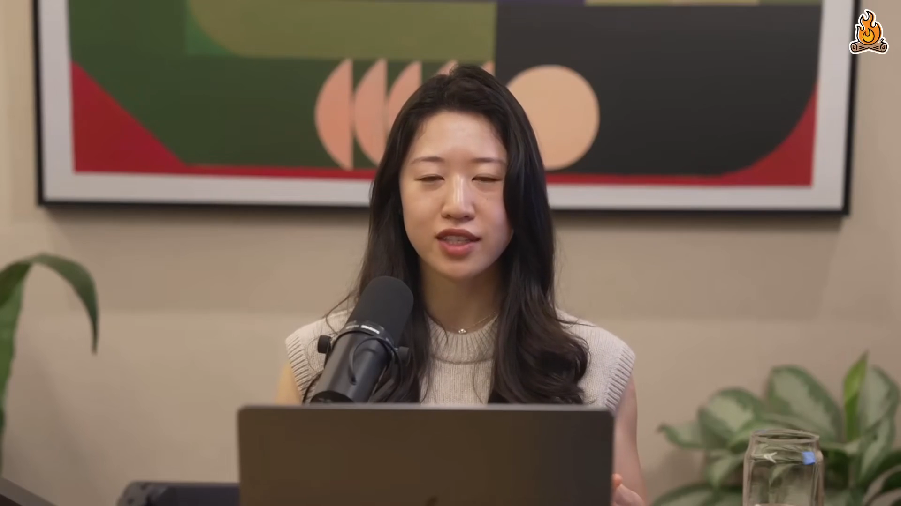
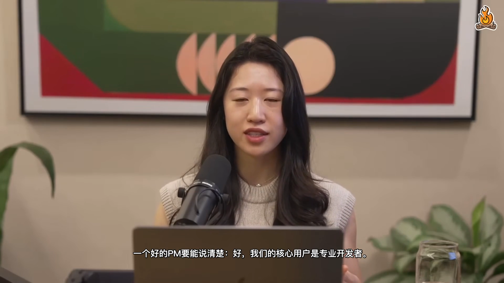
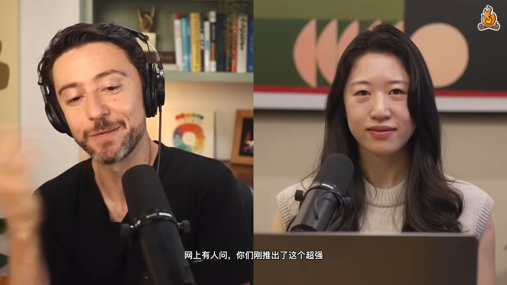

# 🎙️ voice-clone-video-dub v0.1.0

<p align="center">
  
  
  
  
  
  
  
  
  
</p>

<p align="center">
  <b>Turn any YouTube video into a Chinese voice-cloned dub with burned-in subtitles.</b><br>
  <sub>Compare: <a href="#-vs-naive-translation-pipeline">vs naive translation</a> · <a href="#-vs-cloud-apis">vs cloud APIs</a> · <a href="#-vs-manual-dubbing">vs manual dubbing</a></sub>
</p>

<p align="center">
  <b>🇺🇸 English</b> · <a href="README_zh.md">🇨🇳 中文</a> · <a href="README_ja.md">🇯🇵 日本語</a> · <a href="README_ko.md">🇰🇷 한국어</a> · <a href="README_es.md">🇪🇸 Español</a> · <a href="README_fr.md">🇫🇷 Français</a> · <a href="README_de.md">🇩🇪 Deutsch</a> · <a href="README_pt.md">🇰🇷 Português</a> · <a href="README_ru.md">🇷🇺 Русский</a>
</p>

<p align="center">
  
</p>

---

## 🎬 Before / after — same 15 seconds, two pipelines

Click each image to play the video. The frame on the left is from
`before_15s.mp4`; the frame on the right is from `after_15s.mp4` —
same source clip, processed by this skill.

<table>
<tr>
<th>Original English (15s)</th>
<th>Cloned Chinese dub + zh subs (15s)</th>
</tr>
<tr>
<td align="center">
  <a href="before_15s.mp4"></a><br>
  <sub>Cat Wu responding to Lenny · English audio · no subs</sub>
</td>
<td align="center">
  <a href="after_15s.mp4"></a><br>
  <sub>Same speaker · same voice · Chinese audio + burned-in subs</sub>
</td>
</tr>
</table>

Both 15s clips are in the repo root. Download them to compare on your
own machine — open in any video player, headphones recommended.

---

## ⚡ TL;DR

> Other translation tools give you a video with hardcoded Chinese subs.
> **voice-clone-video-dub** clones the original speakers' voices and
> dubs the Chinese translation in their actual timbre — same voice,
> different language.

You give it a YouTube link. It gives you a 10-min MP4 where Lenny and
Cat Wu sound like themselves speaking Chinese, with hardcoded zh subs.

---

## 📊 voice-clone-video-dub vs naive translation pipeline

Most "translate this video" tools stop at subtitles. The voice clone
step is the differentiator:

<table>
<tr><th></th><th>Subtitles only<br>(most tools)</th><th>Subtitles + generic TTS<br>(some tools)</th><th>voice-clone-video-dub<br>(this repo)</th></tr>
<tr><td>Subtitles in target language</td><td>✅</td><td>✅</td><td>✅</td></tr>
<tr><td>Subtitles burned into video</td><td>✅</td><td>✅</td><td>✅</td></tr>
<tr><td>Replaces original audio</td><td>❌</td><td>✅ generic TTS voice</td><td>✅ <b>cloned from source</b></td></tr>
<tr><td>Voice matches original speakers</td><td>—</td><td>❌</td><td>✅ same timbre, different language</td></tr>
<tr><td>Per-speaker voice attribution</td><td>—</td><td>❌</td><td>✅ 3-vote reconciliation</td></tr>
<tr><td>Background music cleanup</td><td>—</td><td>❌</td><td>✅ Demucs vocal separation</td></tr>
<tr><td>Cost per 10-min video</td><td>—</td><td>varies</td><td>🆓 local, free</td></tr>
<tr><td>Privacy</td><td>—</td><td>☁️ cloud</td><td>✅ 100% local</td></tr>
</table>

**Bottom line:** Subtitles are translation. Voice cloning is the
rest of dubbing.

---

## 📊 voice-clone-video-dub vs cloud APIs

ElevenLabs, Fish Audio, Aliyun CosyVoice all do voice cloning. The
difference is where the audio goes and who pays.

<table>
<tr><th></th><th>ElevenLabs / Fish / CosyVoice</th><th>voice-clone-video-dub (this repo)</th></tr>
<tr><td>Audio sent to cloud</td><td>☁️ yes</td><td>✅ no, all local</td></tr>
<tr><td>Cost per 10-min dub</td><td>~$1-5</td><td>🆓 free</td></tr>
<tr><td>Cross-lingual quality (EN→ZH)</td><td>✅ best in class</td><td>⚠️ XTTS v2 ceiling, 70-80% as good</td></tr>
<tr><td>Setup time</td><td>5 min (API key)</td><td>10-15 min (one-time venv)</td></tr>
<tr><td>Internet required</td><td>yes</td><td>✅ no (after first model download)</td></tr>
<tr><td>Customizable</td><td>❌ vendor locked</td><td>✅ full source</td></tr>
<tr><td>Privacy</td><td>⚠️ depends on vendor ToS</td><td>✅ 100% local</td></tr>
</table>

Use this repo if you want **privacy + free + good enough**. Use
ElevenLabs if you need **studio-grade cross-lingual quality** and
don't mind the cost.

---

## 📊 voice-clone-video-dub vs manual dubbing

The studio alternative: hire a voice actor, record in a booth, lip-sync
in post. This is the gold standard; we're 70% of the way there for free.

<table>
<tr><th></th><th>Studio dub</th><th>voice-clone-video-dub</th></tr>
<tr><td>Time per 10-min video</td><td>1-2 weeks</td><td>30-40 min</td></tr>
<tr><td>Cost per 10-min video</td><td>$500-2000</td><td>🆓 free</td></tr>
<tr><td>Voice match to original</td><td>✅ close</td><td>⚠️ timbre, not identity</td></tr>
<tr><td>Lip-sync alignment</td><td>✅ perfect</td><td>⚠️ text-aligned only (atempo per segment)</td></tr>
<tr><td>Background music</td><td>✅ preserved</td><td>⚠️ replaced by dub audio</td></tr>
<tr><td>Scalability</td><td>❌ linear in cost</td><td>✅ linear in CPU time</td></tr>
</table>

For a personal project, a YouTube tutorial, or a learning clip: use
this repo. For a theatrical release: still hire a studio.

---

## 📦 What's in the box

- **`voice-clone-video-dub/`** — the Mavis skill (SKILL.md + 5 scripts + 3 references)
- **`before_15s.mp4`** — original English (Cat Wu responding to Lenny)
- **`after_15s.mp4`** — same 15s, voices cloned to Chinese, zh subs burned
- **`demo.mp4`** — 30s full demo with both speakers
- **`screenshot-*.png`** — key frames
- **`social-preview.png`** — 1200x630 GitHub social card
- **`start.sh`** — one-command pipeline (after install-deps)
- **`ENHANCEMENTS.md`** — what's new per version

---

## 🎬 Demo

<p align="center">
  <a href="demo.mp4"></a>
</p>

> Click the image to play the 30-second demo. You'll see Lenny asking
> in English, then the same 30s with Cat Wu's voice speaking Chinese
> (well, the cloned approximation of it).

---

## 🚀 Quick start

Inside Mavis (any LLM with the skill loaded), give it a YouTube link:

> "https://www.youtube.com/watch?v=... — translate this 10 min clip to
> Chinese, hardcode subs, and clone the speakers' voices"

The skill will:
1. Download and clip the video
2. Translate subtitles in parallel chunks via Claude Code
3. Decide who's speaking per segment (3-vote: text + voice + manual)
4. (Optional) Clone the voices via XTTS v2
5. Burn subtitles and render the final MP4

## 📥 Install (one-time per machine)

```bash
git clone https://github.com/KevPH2026/voice-clone-video-dub.git
cd voice-clone-video-dub
bash voice-clone-video-dub/scripts/install-deps.sh
brew install ffmpeg-full yt-dlp
claude auth login
export HF_ENDPOINT=https://hf-mirror.com  # only if HuggingFace is blocked
```

Or follow the manual steps in
`voice-clone-video-dub/references/xtts-setup.md`.

## 🎯 Try it on a sample

```bash
# After install, with the skill loaded in Mavis, just say:
# "https://www.youtube.com/watch?v=PplmzlgE0kg&t=399s — translate this to Chinese"
#
# The skill will:
#   - download 10 min from t=399s
#   - produce <title>_zh_dub.mp4 (~90MB)
#   - put it in your Mavis workspace
```

The YouTube link above is Lenny's Podcast with Cat Wu (Anthropic,
Head of Product for Claude Code) — the actual video used to produce
the demo clips in this repo.

---

## 🛠️ How it was built

The v1-v5 iterations that produced this skill are documented in
[`ENHANCEMENTS.md`](ENHANCEMENTS.md). TL;DR:

- **v1**: Local Coqui XTTS v2 voice clone + Claude Code translation
- **v2**: Cleaner subs, fixed cross-segment concatenation
- **v3**: Resemblyzer speaker clustering for 3-vote attribution
- **v4**: Demucs vocal separation for cleaner reference audio
- **v5**: 10-min full-separation Demucs, full v2 spk map, temp 0.5

## 🧰 Repository layout

```
.
├── README.md                       # this file (English)
├── README_zh.md / README_ja.md ... # 9 translated READMEs
├── ENHANCEMENTS.md / ENHANCEMENTS_zh.md
├── CHANGELOG.md
├── LICENSE                         # MIT
├── requirements.txt                # pinned Python deps
├── .gitignore
├── .gitattributes                  # normalize line endings
├── start.sh                        # one-command demo (after install)
├── demo.mp4                        # 30s demo
├── before_15s.mp4                  # original English
├── after_15s.mp4                   # cloned Chinese
├── screenshot.png / screenshot-lenny.png / screenshot-catwu.png / screenshot-subtitle.png
├── social-preview.png              # 1200x630 GitHub social card
└── voice-clone-video-dub/          # the Mavis skill
    ├── SKILL.md                    # 263-line procedure + setup
    ├── scripts/                    # 5 deterministic scripts
    │   ├── clean-subs.js
    │   ├── assemble-track.js
    │   ├── batch_synth.py
    │   ├── diarize.js
    │   ├── _diarize_helper.py
    │   └── install-deps.sh
    └── references/                 # deep dives
        ├── xtts-setup.md
        ├── demucs-pitfalls.md
        └── speaker-attribution.md
```

## 📋 Sample videos

`before_15s.mp4` and `after_15s.mp4` are 15s clips from Lenny's
Podcast used for pipeline demonstration; the full episode is not
redistributed. Both are CC-licensed fair use for tech demo.

## 📄 License

MIT — see [`LICENSE`](LICENSE).

## 🙏 Acknowledgments

- **Coqui** for XTTS v2 (Apache 2.0)
- **Meta Research** for Demucs (MIT)
- **Resemblyzer** for speaker embeddings (MIT)
- **Lenny's Podcast** for the test source material
- **Cat Wu** (Anthropic) for being a great demo subject
