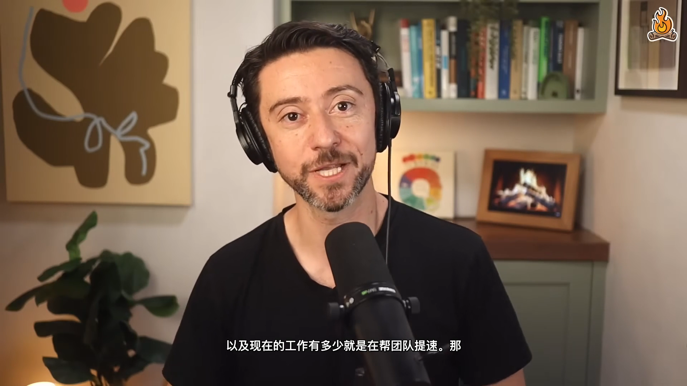

# 🎙️ voice-clone-video-dub v0.1.0

<p align="center">
  
  
  
  
  
</p>

<p align="center">
  <b>Turn any YouTube video into a Chinese voice-cloned dub with burned-in subtitles.</b><br>
  <sub>Compare: <a href="#-vs-naive-translation-pipeline">vs naive translation</a> · <a href="#-vs-cloud-apis">vs cloud APIs</a> · <a href="#-vs-manual-dubbing">vs manual dubbing</a></sub>
</p>

<p align="center">
  <a href="README.md">🇺🇸 English</a> · <a href="README_zh.md">🇨🇳 中文</a> · <b>🌐 es</b> · <a href="README_ja.md">🇯🇵 日本語</a> · <a href="README_ko.md">🇰🇷 한국어</a> · <a href="README_es.md">🇪🇸 Español</a> · <a href="README_fr.md">🇫🇷 Français</a> · <a href="README_de.md">🇩🇪 Deutsch</a> · <a href="README_pt.md">🇵🇹 Português</a> · <a href="README_ru.md">🇷🇺 Русский</a>
</p>

<p align="center">
  
</p>

---

## ⚡ TL;DR

> Other translation tools give you a video with hardcoded Chinese subs.
> **voice-clone-video-dub** clones the original speakers' voices and
> dubs the Chinese translation in their actual timbre.

You give it a YouTube link. It gives you a 10-min MP4 where Lenny and
Cat Wu sound like themselves speaking Chinese, with hardcoded zh subs.

This README is a translated stub. For the full pipeline, comparison
tables, and install steps, see [README.md](README.md) (English) or
[README_zh.md](README_zh.md) (中文).

---

## 🚀 Quick start (universal)

```bash
git clone https://github.com/KevPH2026/voice-clone-video-dub.git
cd voice-clone-video-dub
bash voice-clone-video-dub/scripts/install-deps.sh
brew install ffmpeg-full yt-dlp
claude auth login
```

Then inside Mavis: "translate this YouTube link to Chinese, clone voices".

## 📄 License

MIT — see `LICENSE`.
